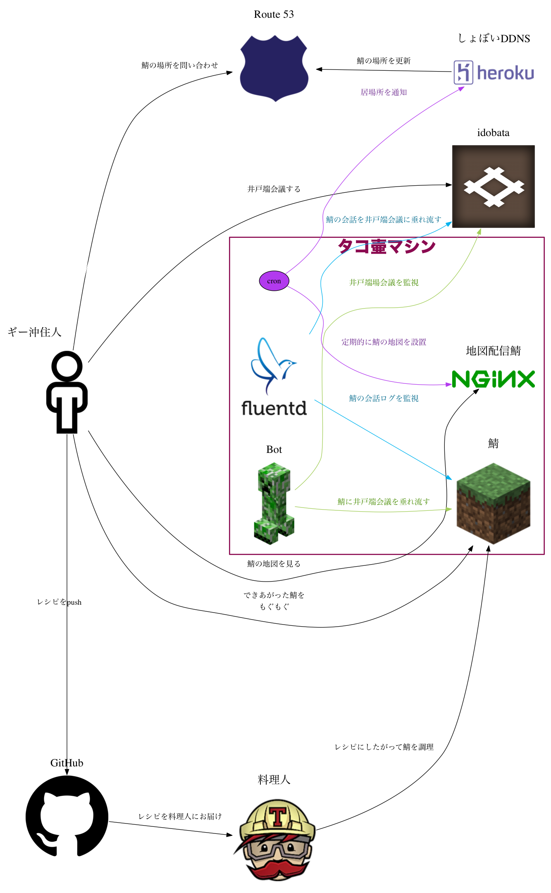

- adduser octpus
- adduser octpus sudo
- `mkdir /home/octpus/.ssh`
- add octpus.pub to `/home/octpus/.ssh/authorized_keys`
- disable user password login
- disable root password login
- add `octpus  ALL=(ALL:ALL) NOPASSWD:ALL`

## 図

### 生成

    $ bundle exec ruby architecture_diagram.rb

### 図の出典
- [GitHub logo](https://github.com/logos)
- [github/octicons](https://github.com/github/octicons)
- [Travis CI ICON](https://github.com/travis-ci/travis-web)
- [minecraft苔土](http://minecraft.gamepedia.com/File:Grass.png?version=cc7486e734b2f998b826fbdfe5e1396c)
- [クリーパー](http://minecraft.gamepedia.com/File:Creeper.png?version=a2a546a1c2cde96b336376ec898a0597)
- [File:AWS Simple Icons Networking Amazon Route 53.svg - Wikimedia Commons](http://commons.wikimedia.org/wiki/File:AWS_Simple_Icons_Networking_Amazon_Route_53.svg?uselang=ja)
- [File:Heroku logo.png - Wikipedia, the free encyclopedia](http://en.wikipedia.org/wiki/File:Heroku_logo.png)
- [IdobataのGitHub登録メールアドレスのGravatar](https://github.com/idobata)
- [Fluentdロゴ | Fluentd](http://docs.fluentd.org/ja/articles/logo)
- [File:Nginx logo.svg - Wikimedia Commons](http://commons.wikimedia.org/wiki/File:Nginx_logo.svg)
